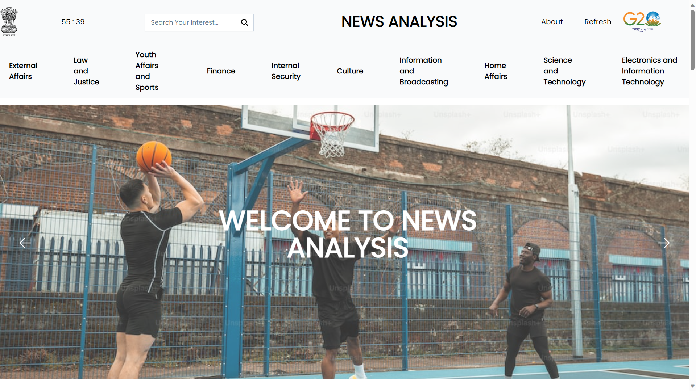
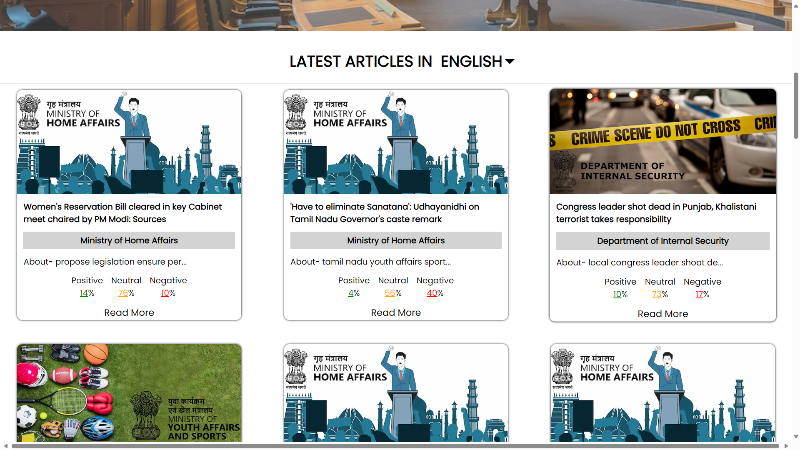
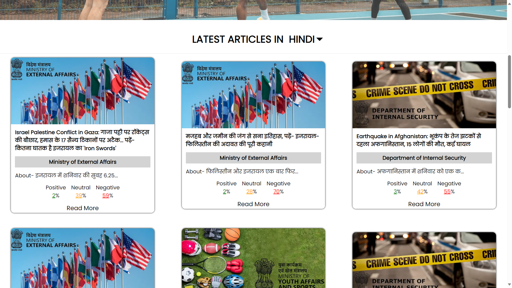

Real-Time Digital News Crawling, Sentiment Analysis, and Alert Mechanism for Government Authorities 

Governments have a permanent obligation to monitor public sentiment, predict crises, and react to emerging problems, requiring access to large amounts of digital news content.
The system provides Real-Time Digital News Crawling, Sentiment Analysis, and Alert Mechanism to help governments cope with this challenge.
A high-performance web crawler constantly collects news stories from various sources, including news sites, social media, and blogs, to provide a comprehensive view of public opinion.
Sophisticated natural language processing (NLP) methods analyze the data in real-time, extracting sentiment and determining key topics to identify potential threats and trends.
The system initiates customizable alerts via email when predefined keywords, sentiment levels, or crisis indicators are detected, enabling authorities to make informed decisions and enhance public safety and governance effectiveness.

## Screenshots
  
 
  
 
  

[Screenshots Link](https://www.canva.com/design/DAFwxcZCMK8/pz5Z4bYMwfMgdxuzhGVv0g/edit)

